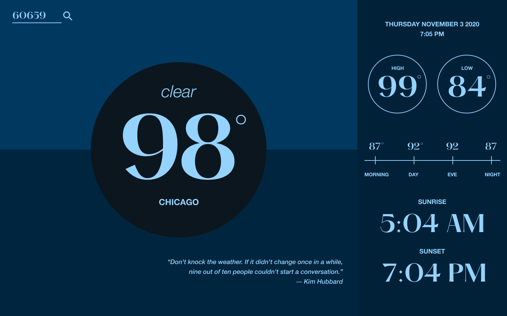

# The Weather



### Enter a location and recieve a stylish weather report. Theme changes color based on the time of day.  

Recommended queries:
```
'Kiev'
'Split, Croatia'
'Okinawa'
'Vatican City',
'Chicago'
```
### Designs
Created in Figma. [View Designs](https://www.figma.com/file/uSSTiOfwCXVBvqZ8xfMt59/Untitled?node-id=0%3A1).

### Note:
The API Limit for this application is currently `1000` calls per day. If you would like to increase this limit please venmo `@darrenangle` $40USD to increase the limit to `2000` calls per day for 1 month.

## Run The App Locally

In the project directory, you can run:

#### `yarn start`

Runs the app in the development mode.\
Open [http://localhost:3000](http://localhost:3000) to view it in the browser.


#### `yarn test`

Runs integration test suite for component-only integration tests and function unit tests.

#### `yarn e2e`

Builds a prod app, serves it, runs headless e2e tests against it using cypress. If cypress is not installed there is a potential that the cypress app verification will time out the runner. Running the command again should solve this problem.

--- 
### Some Technical Details

1. `React` and `Typescript` using create-react-app
2. `redux` is the current store for global state, though the app is architected to be store-agnostic. To change the store, implement the `GlobalStoreInteractor` interface with a store wrapper that uses implict subscriptions.
3. `AWS Lambda` 'backend' to consolidate api calls and obscure api keys
4. `Google Geocoding API` to process queries and return a lat long
5. `Open Weather API (OneCall)` to produce weather data from lat long
6. `Cypress` for e2e testing
7. `gts`, `prettier` for typescript linting config
---

### todos:

1. Add an overlay that responds to visibility data and darkens or lightens the theme.
2. Better error handling for:
   1. Odd locations
   2. API Limit hitting
3. UI Tweaking:
   1. Better responsivity across elements
   2. Better match the designs


